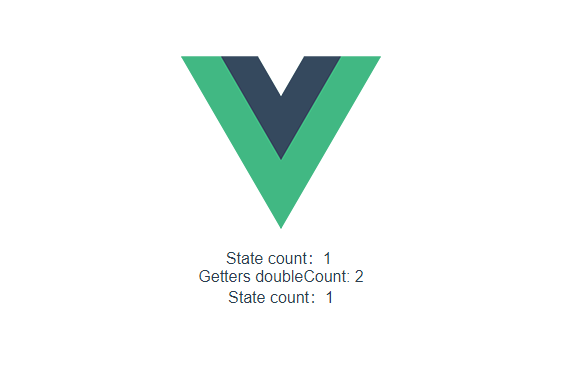
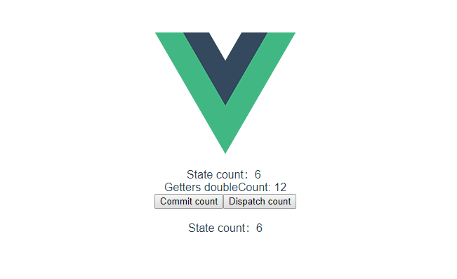

# 前言
[Vuex](https://vuex.vuejs.org/zh/)可**集中式**的管理应用中的组件状态，并且按照一定的规则**可预测**状态的变化。

这个状态自管理应用包含以下几个部分：
- `state`，驱动应用的数据源；
- `view`，以声明方式将 state 映射到视图；
- `actions`，响应在 view 上的用户输入导致的状态变化。


## 基本使用
```js
import Vue from 'vue'
import Vuex from 'vuex'

Vue.use(Vuex);

const store = new Vuex.Store({
  state: {
    count: 1
  },

  mutations: {
    increment (state) {
      state.count++
    }
  },

  actions: {
    increment({commit}, paylaod) {
      setTimeout(function () {
        commit('increment')
      }, 1000)
    }
  },

  getters: {
      doubleCount: (state) => state.count * 2
  }
})
```

## 实现目标
- 插件`install`方法
- `Store`类的状态管理

---

## 实现`install`方法
该方法的实现类似于，`vue-router`的[install](./手写vue系列（二）.html###实现静态`install`方法)实现
```js
let _Vue

const install = function (Vue) {
    _Vue = Vue

    Vue.mixin({
        beforeCreate() {
            if (this.$options.store) {
                Vue.prototype.$store = this.$options.store
            }
        }
    })
}


export default {
    install
}
```

## 实现`Store`类
`Store`类的实现大概分为：
- 响应式的`state`
- 响应式的`getters`
- 同步`commit`函数
- 异步`dispatch`函数

先构造`Store`类的基本结构:
```js
class Store {
    constructor(options) {
        this.state = options.state
        this.getters = options.getters
        this.mutations = options.mutations
        this.actions = options.actions
    }

    commit(mutationKey) {

    }

    dispatch(actionKey) {

    }
}
```

### 响应式`state`
当`state`变化时，各组件的界面也需要相应的变化，所有`state`应该是响应式的，
我们可以"借鸡生蛋"的方式，借用`Vue`函数来构造:

```js
class Store {
    constructor(options) {
        this.state = new _Vue({
            data: options.state
        })

    }

    commit(mutationKey) {

    }

    dispatch(actionKey) {

    }
}
```
在组件我们就可以用`$store.state.count`来访问`count`变量了。

这里会有一个问题，我们不希望用户直接给`state`赋值，如：`store.state = {}`，所以我们就需要将`state`在内部隐藏起来，且不能直接设置。
```js
class Store {
    constructor(options) {
        this._vm = new _Vue({
            data: {
                $$state: options.state
            }
        })

        this.getters = options.getters
        this.mutations = options.mutations
        this.actions = options.actions
    }

    // state getter
    get state() {
        return this._vm._date.$$state
    }

    //  state setter
    set state(value) {
        console.warn('can not set state')
    }

    commit() {

    }

    dispatch() {

    }
}
```
:::tip  
在`vue`中当遇到`$$`开头的属性时就会放弃代理该属性，即：隐藏该属性，无法在实例中直接显示出来，但是可以通过`vm._data`来获取值。
:::

### 响应式`getters`
在`vuex`中`gettter`是从`state`中派生出的一些状态，简单理解就是：`store`中的`computed`计算属性，有以下特点：
- 响应式的
- 可缓存的
- 通过`store.getters`代理访问


那么我们可以通过将用户设置的`getter`挂载到`Vue`实例上的`computed`计算属性来实现。
```js {4, 29}
constructor(options) {

        this.getters = {}
        const computed = {}
        const store = this
        Object.keys(options.getters).forEach((key) => {
            // 获取用户定义的getter
            const fn = options.getters[key]

            // 放置到_vm的computed中
            // 因为vue中computed是无参数的而用户设置的getter是带参数的，进行一层封装
            computed[key] = function warpComputedGetter() {
                return fn(store.state)
            }

            // 代理store.getters,且为只读
            Object.defineProperty(store.getters, key, {
                get() {
                    return store._vm[key]
                }
            })
        })

        this._vm = new _Vue({
            data: {
                // 在vue中遇到$$开头的就会放弃代理，即：在实例上隐藏该属性。可以通过vm._data访问
                $$state: options.state
            },
            computed,
        })


        this.mutations = options.mutations
        this.actions = options.actions
    }
```

示例：  


### 实现`commit`函数
对于实现`commit`函数，我们只需要获取用户设置的`mutations`，然后执行即可。
```js
    commit(mutationsType) {
        const mutation = this.mutations[mutationsType]
        if (!mutation) {
            console.warn('mutation is not exist:' + mutationsType);
            return
        }

        mutation(this.state)
    }
```

### 实现`dispatch`函数
同样的，按理说对于实现`dispatch`函数，我们只需要获取用户设置的`actions`，然后执行即可。
```js
    dispatch(actionType, payload) {
        const action = this.actions[actionType]
        if (!action) {
            console.warn('action is not exist:' + actionType);
            return
        }
        action(this, payload)
    }
}
```
但是，由于`dispatch`是异步的，所以当再执行`commit`修改`state`时，会出现此时的`this`已经不指向`store`实例了，所以，这里要修改`commit`的指向让其一直指向`store`。
```js {4,,35,36}
constructor(options) {
        this.getters = {}
        const computed = {}
        const store = this
        Object.keys(options.getters).forEach((key) => {
            // 获取用户定义的getter
            const fn = options.getters[key]

            // 放置到_vm的computed中
            // 因为vue中computed是无参数的而用户设置的getter是带参数的，进行一层封装
            computed[key] = function warpComputedGetter() {
                return fn(store.state)
            }

            // 代理store.getters,且为只读
            Object.defineProperty(store.getters, key, {
                get() {
                    return store._vm[key]
                }
            })
        })

        this._vm = new _Vue({
            data: {
                // 在vue中遇到$$开头的就会放弃代理，即：在实例上隐藏该属性。可以通过vm._data访问
                $$state: options.state
            },
            computed,
        })

        this.mutations = options.mutations
        this.actions = options.actions

        // 修改commit和dispatch的this指向store
        this.commit = this.commit.bind(store)
        this.dispatch = this.dispatch.bind(store)
    }
```

最终实现效果:


## 链接
- [代码git地址](https://github.com/GitHubForQiuKai/quickx)
- [博客地址](https://qiukai666.gitee.io/treasureMap/blog/手写vue系列/手写vue系列（三）.html)