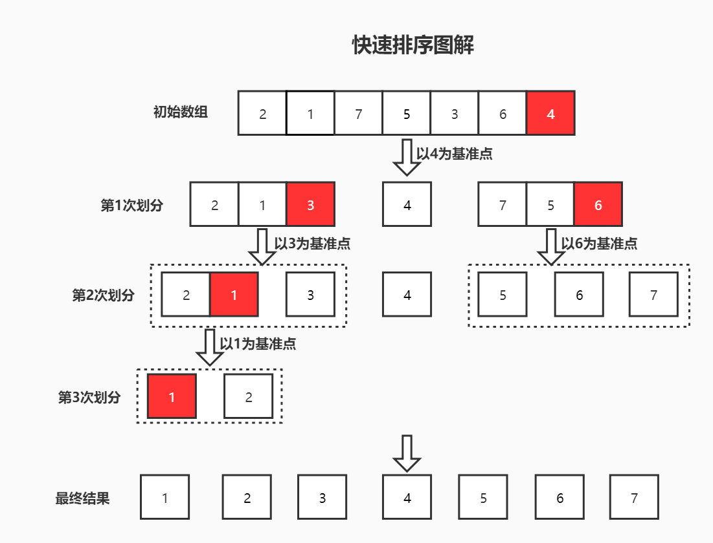
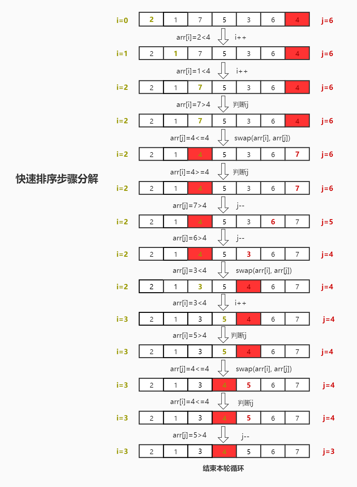

# 快速排序
快速排序是我们应用最广泛的排序算法之一，是一种**分治思想**算法。它和[归并排序]()是互补的排序算法。

## 基本思想
1. 在数列中选一个[基准点](##基准点)；
2. 将小于基准点的数放左区间，大于基准点的数放左区间；
3. 继续对剩余的左右两区间做同样的处理操作；
4. 直到没有可划分的区间为止。



## 优点
- 实现简单
- 速度快  
    平均时间复杂度`O(nlogn)`
- 原地排序

## 缺点
- 时间复杂度不稳定  
    若待排数列是有序，则时间复杂度上升至`O(n^2)`
- 速度的快慢依赖于[基准点](##基准点)的选择的好坏
- 不稳定排序

## 基准点
在实际排序中，基准点的选择最终都不会影响**排序结果**，但是不同的基准点会影响到**整体排序时间**
:::tip  
因为基准点的选择，会影响到左右两区间的分区大小，很显然，如果每次分区后的左右两区间大小相同，那么其排序时间是最短的。
:::
**所以说，如何选着一个好的基准点是至关重要的。**

### 第一个或最后一个
选择第一个或者最后一个，这应该是我们最常见的方案。

### 随机获取

### 取中间值

## 快排实现
按照实现方式可分为以下几种：
- 递归实现
    - 左右指针法
    - 挖坑法
    - 前后指针法
- 非递归实现

### 左右指针法
1. 选取基准点（这里选择的是数组最后一个）；
2. 先从数组左侧开始遍历，当有数大于或等于基准点时，记录下标并停止；
3. 然后再从数组右侧开始遍历，当有数小于或等于基准点时，记录下标并停止；
4. 交换左右下边对应的数；
5. 重复上述`1~4`步。

下面时第一次遍历的步骤图解



`JavaScript`的代码实现
```js
// 以最后一位数为基准点的实现
function quickSort(arr, l, r) {
    // 递归终止条件
    if(l >= r) return

    const point = arr[r - 1]
    let left = l
    let right = r

    while(left < right) {
        // 先判断左侧下标
        while(arr[left] < point) {
            left++
        }

        // 再判断右侧下标
        while(arr[right] > point) {
            right--
        }

        // 上述条件都不满足：说明左半区存在大于基准点的数，右边区存在小于基准点的数；则交换
        swap(left, right, arr)
    }


    // 递归左半区和右半区
    quickSort(arr, l, left - 1)
    quickSort(arr, right, r - 1)
}

// 交换
function swap(m, n, arr) {
    const temp = arr[m]
    arr[m] = arr[n]
    arr[n] = temp
}
```

## 复杂度
