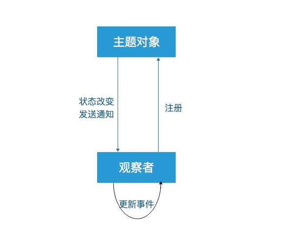

# 观察者模式

## 基本介绍
观察者模式（有时又被称为模型（Model）-视图（View）模式、源-收听者(Listener)模式或从属者模式）属于[行为型模式]()中的一种。

它定义了一种**一对多**的组合关系，当主题对象（一）状态发生变化时，会将通知发送到所有的观察者对象（多），由其做相应的逻辑处理。

## 实现
### 要素
- **角色**
    - [主题对象（Subject）](#主题对象)
        - **·** 观察者容器
        - **·** 增加、删除、通知观察者对象的方法
    - [观察者（Observer）](#观察者)
        - **·** 接到观察者通知后的更新方法
- **动作**
    - **·** 注册
    - **·** 通知
    - **·** 更新



### 主题对象
下面是js实现版：
```js
var Subject = function() {
    this.state = 1;
    this._listeners = [];
}

Subject.prototype.add = function(observer) {
    return this._listeners.push(observer);
}

Subject.prototype.remove = function(observer) {
    var index = this._listeners.indexOf(observer, 0);
    if(index !== -1) {
        this._listeners.splice(index,1);
    }
}

Subject.prototype.fire = function() {
    var count = this._listeners.length;
    for(var i =0;i<count;i++) {
        this._listeners[i].update(this.state);        
    }
    this.state ++;
}

```

### 观察者
下面是js实现版：
```js
var Observer = function() {
    this.update = function(state) {
        console.log('接受通知并执行更新，',state);
    }
}
```

具体使用：
```js
var subject = new Subject();

var observer1 = new Observer();
subject.add(observer1);
subject.fire();
// 接受通知并执行更新， 1

var observer2 = new Observer();
var observer3 = new Observer();
subject.add(observer2);
subject.add(observer3);
subject.fire();
// 接受通知并执行更新， 2
// 接受通知并执行更新， 2
// 接受通知并执行更新， 2

subject.remove(observer3);
subject.fire();
// 接受通知并执行更新， 3
// 接受通知并执行更新， 3
```