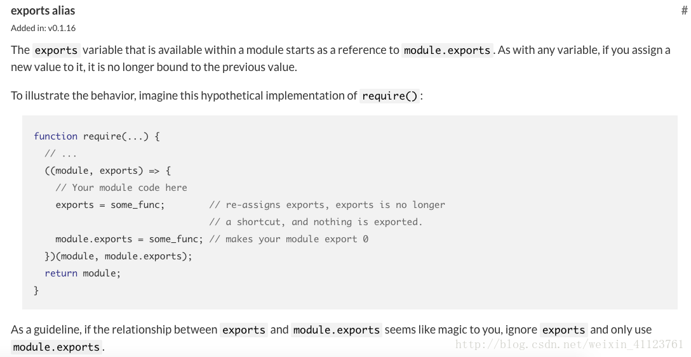

# 模块

## 什么是模块
在程序设计中，模块是指为完成某一功能所需的一段程序或子程序。它具有两个基本特征：**外部特征**和**内部特征**。  

外部特征是指模块跟外部环境所联系的接口（即其他模块或程序调用该模块的方式，包括有输入输出参数、引用的全局变量）和模块的功能；内部特征是指模块的内部环境具有的特点（即该模块的局部数据和程序代码）。  

简单的说：**模块就是实现特定功能的一组方法。**

## 基本写法
### 原始写法
是要把不同的函数（以及需要记录状态的变量）简单的放在一起，就构成了一个模块。
```js
function() m1{
    //...
}
function() m2{
    //...
}
```
上面的函数m1和m2就构成了一个模块，使用的时候直接调用就行了。
但是，缺点也很明显，“污染”了全局变量，无法保证不和其他模块发生变量名冲突的情况。

### 对象写法
顾名思义，就是把模板成员封装到一个对象中。
```js
var module = new Object({
    _count: 1,
    m1: funtion() {
        //...
    },
    m2: funtion() {
        //...
    }
});
```
使用的时候，直接调用这个对象的属性```module.m1()```。   
但是，这样的写法会暴露所有模块成员，内部状态可以被外部改写。比如，外部代码可以直接改变内部计数器的值。
```js
module._count = 3;
```

### 立即执行函数写法
使用"立即执行函数"（Immediately-Invoked Function Expression，IIFE）。
```js
var module = (function(){
    var _count = 1,
    var m1 = funtion() {
        //...
    },
    var m2 = funtion() {
        //...
    }
    return {
        m1,
        m2,
    }
})();
```
这样外部代码无法读取内部的_count变量。
```js
module._count // undefined
```
### 模块继承
如果一个模块过大，可能会拆分为多个模块。
```js
var module = (function(mod){
    mod.m3 = function() {
        //...
    }
})(module || {});
```
上面的代码为module模块添加了一个新方法m3()，然后返回新的module模块。

### 输入全局变量
为了保持模块的独立性，模块内部最好不与程序的其他部分直接交互。   
而为了在模块内部调用全局变量，必须显式地将其他变量输入模块。
```js
var module = (function($) {
    //...
})(jQuery);
```
上面的module模块需要使用jQuery库，就把这个库（其实是个模块）当作参数输入module。这样做除了保证模块的独立性，还使得模块之间的依赖关系变得明显。

## 发展及规范
2009年，美国程序员Ryan Dahl创造了node.js项目，将javascript语言用于服务器端编程。
这标志"Javascript模块化编程"正式诞生。  

在这之前，在浏览器环境下，没有模块也不是特别大的问题，毕竟网页程序的复杂性有限；但是在服务器端，一定要有模块，与操作系统和其他应用程序互动，否则根本没法编程。

### CommonJS
#### **实现代表**：nodeJS  
#### **关键字**：`module.exports`、`exports`、`require`  

这里的CommonJS规范指的是CommonJS Modules/1.0规范。  

CommonJS是一个更偏向于服务器端的规范。NodeJS采用了这个规范。CommonJS的一个模块就是一个脚本文件。

#### 形式
定义：
```js
// export.js
var m1 = function (){};

module.exports = m1;
//或：exports.m1 = m1; // module.exports 和 exports 在下面会讲到
```

加载：
```js
// import.js
var m1 = require('./export.js');

m1();

```

#### module对象
Node内部提供一个Module构建函数。所有模块都是Module的实例。
```js
function Module(id, parent){
    this.id = id;
    this.exports = {};
    this.parent = parent;
    //...
}
```
例如：
```js
// example.js
console.log(module)
```
输出值：
```js
Module {
  id: '.',
  exports: {},
  parent: null,
  filename: '/Users/qiukai/Desktop/example.js',
  loaded: false,
  children: [],
  paths: 
   [ '/Users/qiukai/Desktop/node_modules',
     '/Users/qiukai/node_modules',
     '/Users/node_modules',
     '/node_modules' ] }
```
|属性|含义|
|-|-|
|module.id|模块标识符，通常是带有绝对路径的模块文件名|
|module.exports|表示模块对外输入的值|
|module.parent|表示引用该模块的模块|
|module.filename|带有绝对路径的模块名|
|module.loaded|模块是否已加载|
|module.children|表示该模块引用的其他模块|
|module.paths|表示该模块可能存在的路径|

**注**：可根据module.parent是否为null来判断当前模块是否为入口脚本。

#### module.exports和exports
`exports`其实就是`module.exports`的别名，官方给出的解释：

可以看出，将module.exports作为立即执行函数的第二个参数传入，并重新定义了exports接受它。其实，就可以理解为，在每个模块头部，加上
```js
var exports = module.exports;
```
**注意：不能直接将exports变量指向一个值，因为这样等于切断了exports与module.exports的引用。**

所以说，下面的一些写法将是无效的，
```js
// 例1
exports = function() {};

// 例2
exports.m1 = function() {};
module.exports = 'Hello world';//实际导出的是hello world
```
如果你觉得exports与module.exports之间的区别很难分清，一个简单的处理方法，就是放弃使用exports，只使用module.exports。


### AMD
#### **实现代表**：[requireJS](https://requirejs.org/docs/api.html#define)
#### **关键字**：`define`、`require`

#### 背景
服务端有了commonJS模块后，自然想到，客户端也能不能拥有类似的模块加载机制，而且最好两者能够兼容，一个模块不用修改，在服务器和浏览器都可以运行。
例：
```js
var math = require('math');
math.add(2, 3);
```

但是，这样的话会存在一个问题，就是服务器模块是存放在本地硬盘，加载的速度取决于硬盘的读取速度，速度一般很快，可同步加载；而在浏览器端，加载的速度取决于网速，而网速是不可预知的，如果网速过慢，那么，浏览器就会处于“假死”的状态了。

所以，浏览器端的模块，不能采用"同步加载"（synchronous），只能采用"异步加载"（asynchronous）。这就是AMD规范诞生的背景。

#### 形式
[AMD](https://github.com/amdjs/amdjs-api/wiki/AMD)是”Asynchronous Module Definition”的缩写，即”异步模块定义”。它采用异步方式加载模块，模块的加载不影响它后面语句的运行。 

**这里异步指的是不堵塞浏览器其他任务（dom构建，css渲染等），而加载内部是同步的（加载完模块后立即执行回调）。**

RequireJS的基本思想是，通过define方法，将代码定义为模块；通过require方法，实现代码的模块加载。

定义：
```js
define(id?, dependencies?, factory);
```
- id：模块的名字，如果没有提供该参数，模块的名字应该默认为模块加载器请求的指定脚本的名字。
- dependencies：模块的依赖，已被模块定义的模块标识的数组字面量。依赖参数是可选的，如果忽略此参数，它默认为 ["require", "exports", "module"]。然而，如果工厂方法的长度属性小于3，加载器会选择以函数的长度属性指定的参数个数调用工厂方法。
- factory：模块工厂；如果是函数，那么该函数只北、被执行一次；如果是对象，那么就最为模块的返回值。

加载：
```js
require([module], callback);
```
- module：代表所需要加载的模板数组。
- callback：加载完成后的回调。

#### 独立模块
如果定义一个模块，不需要依赖其他任何模块，可以直接用define方法生成。
```js
define('module',function() {
    return {
        method1: function() {},
        method2: function() {},
    }
})
```
define定义的模块可以返回任何值，不限于对象。

#### 非独立模块

例1：
```js
// add.js
define('add',function() {
    return function(x,y) {
        return x + y;
    }
})

// main.js
require(['add'], function(add) {
 add(1, 1);
})
```

例2：
```js
// add.js
define('add',function() {
    return function(x,y) {
        return x + y;
    }
})

// divide.js
define('divide',function() {
    return function(x,y) {
        return x / y;
    }
})

// math.js
define('math',['add','divide'],function(add,divide) {
    return {
        add: add,
        divide: divide,
    };
})

// main.js
require(['math'], function(math) {
  math.add(1, 1);
  math.divide(1, 1);
})
```

如果依赖的模块很多，参数与模块一一对应的写法非常麻烦。
```js
define(
    ['dep1', 'dep2', 'dep3', 'dep4', 'dep5', 'dep6', 'dep7', 'dep8'],
    function(dep1,   dep2,   dep3,   dep4,   dep5,   dep6,   dep7,   dep8){
        ...
    }
);
```
为了避免像上面代码那样繁琐的写法，RequireJS提供一种更简单的写法。
```js
define(
    function (require) {
        var dep1 = require('dep1'),
            dep2 = require('dep2'),
            dep3 = require('dep3'),
            dep4 = require('dep4'),
            dep5 = require('dep5'),
            dep6 = require('dep6'),
            dep7 = require('dep7'),
            dep8 = require('dep8');
            ...
    }
});
```
当require()函数模块的时候，就会先加载零个或多个依赖，会将所有的依赖都写在define()函数第一个参数数组中，所以说**AMD是依赖前置的**。这不同于CMD规范，它是依赖就近的。

#### require调用
- 条件加载
    ```js
    require( [ window.JSON ? undefined : 'util/json2' ], function ( JSON ) {
    JSON = JSON || window.JSON;

    console.log( JSON.parse( '{ "JSON" : "HERE" }' ) );
    });
    ```
    上面代码加载JSON模块时，首先判断浏览器是否原生支持JSON对象。如果是的，则将undefined传入回调函数，否则加载util目录下的json2模块。

- 动态加载
    ```js
    define(function ( require ) {
        var isReady = false, foobar;
    
        require(['foo', 'bar'], function (foo, bar) {
            isReady = true;
            foobar = foo() + bar();
        });
    
        return {
            isReady: isReady,
            foobar: foobar
        };
    });
    ```
    上面代码所定义的模块，内部加载了foo和bar两个模块，在没有加载完成前，isReady属性值为false，加载完成后就变成了true。因此，可以根据isReady属性的值，决定下一步的动作。

- promise
    ```js
    define(['lib/Deferred'], function( Deferred ){
        var defer = new Deferred(); 
        require(['lib/templates/?index.html','lib/data/?stats'],
            function( template, data ){
                defer.resolve({ template: template, data:data });
            }
        );
        return defer.promise();
    });
    ```
    上面代码的define方法返回一个promise对象，可以在该对象的then方法，指定下一步的动作。

- JSONP
    ```js
    require( [ 
        "http://someapi.com/foo?callback=define"
    ], function (data) {
        console.log(data);
    });
    ```
    如果服务器端采用JSONP模式，则可以直接在require中调用，方法是指定JSONP的callback参数为define。

- 错误回调
    ```js
    require(
        [ "backbone" ], 
        function ( Backbone ) {
            return Backbone.View.extend({ /* ... */ });
        }, 
        function (err) {
            // ...
        }
    );
    ```
    require对象还允许指定一个全局性的Error事件的监听函数。所有没有被上面的方法捕获的错误，都会被触发这个监听函数。
    ```js
    requirejs.onError = function (err) {
        // ...
    };
    ```

#### config配置
require方法本身也是一个对象，它带有一个config方法，用来配置require.js运行参数。config方法接受一个对象作为参数。
```js
  require.config({
    baseUrl: "/another/path",
    paths: {
        "some": "some/v1.0"
    },
    waitSeconds: 15
  });
```
- baseUrl  
 指定本地模块的基准目录，即本地模块的路径是相对于那个目录的，该属性通常由requireJS在页面加载时的data-main属性指定。

- paths  
paths是映射那些不直接放在baseUrl指定的目录下的文件，设置paths的起始位置是相对于baseUrl的，除非该path设置是以”/”开头或含有URL协议(http://或者https://)。

- bundles

- shim  
解决使用非AMD方式定义的模块(如jquery插件)及其载入顺序，为那些没有使用define()来声明依赖关系，设置模块的”浏览器全局变量注入”型脚本做依赖和导出配置。

- map  
对于给定的模块前缀，使用一个不同的模块ID来加载该模块。

- config  
常常需要将配置信息传给一个模块。这些配置往往是application级别的信息，需要一个手段将它们向下传递给模块。在RequireJS中，基于requirejs.config()的config配置项来实现。要获取这些信息的模块可以加载特殊的依赖“module”，并调用module.config()。

- packages  
从CommonJS包(package)中加载模块。参见从包中加载模块。（链接：http://requirejs.cn/docs/commonjs.html）

- nodeIdCompat  
Node对待模块example.js和example是一样的.默认在RequireJS中有两个不同的标识。

- waitSeconds  
 在放弃加载脚本之前等待的秒数。将其设置为0将禁用超时。默认为7秒。

- context  
命名一个加载上下文。这允许require.js在同一页面上加载模块的多个版本，如果每个顶层require调用都指定了一个唯一的上下文字符串。

- deps  
指定要加载的一个依赖数组。当将require设置为一个config object在加载require.js之前使用时很有用。一旦require.js被定义，这些依赖就已加载。使用deps就像调用require([])，但它在loader处理配置完毕之后就立即生效。它并不阻塞其他的require()调用，它仅是指定某些模块作为config块的一部分而异步加载的手段而已。

- callback  
在deps加载完毕后执行的函数。当将require设置为一个config object在加载require.js之前使用时很有用，其作为配置的deps数组加载完毕后为require指定的函数。

- enforceDefine  
如果设置为true，则当一个脚本不是通过define()定义且不具备可供检查的shim导出字串值时，就会抛出错误。参考在IE中捕获加载错误一节。

- xhtml  
 如果设置为true，document.createElementNS()将用于创建脚本元素。

- urlArgs  
RequireJS获取资源时附加在URL后面的额外的query参数。作为浏览器或服务器未正确配置时的“cache bust”手段很有用

- scriptType  
指定RequireJS将script标签插入document时所用的type=""值。默认为“text/javascript”。想要启用Firefox的JavaScript 1.8特性，可使用值“text/javascript;version=1.8”。

- skipDataMain  
在2.1.9中被引入：如果设置为true,就会跳过data-main属性的扫描启动模块的加载。如果RequireJS嵌入到一个通用的库中以其他页面中的RequireJS交互，且嵌入的版本不会使用data-main加载

### CMD
#### **实现代表**：seaJS   
#### **关键字**：`define`、`require`、`export`、`module`、`use`

#### 形式
[CMD](https://github.com/amdjs/amdjs-api/wiki/AMD)是”Common Module Definition”的缩写。同AMD一样，它采用异步方式加载模块，模块的加载不影响它后面语句的运行。 

SeaJS的基本思想是，通过define方法，将代码定义为模块；通过require方法，实现代码的模块加载。

定义：
```js
define(id?, dependencies?, factory);
```
- id：模块的名字。
- dependencies：模块的依赖。
- factory：模块工厂；可以为函数、对象或字符串。

加载：
```js
use([module], callback);
```
- module：代表所需要加载的模板数组。
- callback：加载完成后的回调。

#### define 
define 接受 factory 参数，factory 可以是一个函数，也可以是一个对象或字符串。

factory 为对象、字符串时，表示模块的接口就是该对象、字符串。比如可以如下定义一个 JSON 数据模块：
```js
define({ "foo": "bar" });
```

也可以通过字符串定义模板模块：
```js
define('I am a template. My name is {{name}}.');
```

factory 为函数时，表示是模块的构造方法。执行该构造方法，可以得到模块向外提供的接口。factory 方法在执行时，默认会传入三个参数：require、exports 和 module：
```js
define(function(require, exports, module) {

  // 模块代码

});
```

define 也可以接受两个以上参数。字符串 id 表示模块标识，数组 deps 是模块依赖。比如：
```js
define('hello', ['jquery'], function(require, exports, module) {

  // 模块代码

});
```
id 和 deps 参数可以省略。省略时，可以通过构建工具自动生成。

**注意**：带 id 和 deps 参数的 define 用法不属于 CMD 规范，而属于 Modules/Transport 规范。

#### require
require 是 factory 函数的第一个参数。

##### require(id)
require 是一个方法，接受 模块标识 作为唯一参数，用来获取其他模块提供的接口。
```js
define(function(require, exports) {

  // 获取模块 a 的接口
  var a = require('./a');

  // 调用模块 a 的方法
  a.doSomething();

});
```
注意：在开发时，require 的书写需要遵循一些 简单约定。

##### require.async require.async(id, callback?)
require.async 方法用来在模块内部异步加载模块，并在加载完成后执行指定回调。callback 参数可选。
```js
define(function(require, exports, module) {

  // 异步加载一个模块，在加载完成时，执行回调
  require.async('./b', function(b) {
    b.doSomething();
  });

  // 异步加载多个模块，在加载完成时，执行回调
  require.async(['./c', './d'], function(c, d) {
    c.doSomething();
    d.doSomething();
  });

});
```
注意：require 是同步往下执行，require.async 则是异步回调执行。require.async 一般用来加载可延迟异步加载的模块。

##### require.resolve require.resolve(id)
使用模块系统内部的路径解析机制来解析并返回模块路径。该函数不会加载模块，只返回解析后的绝对路径。
```js
define(function(require, exports) {

  console.log(require.resolve('./b'));
  // ==> http://example.com/path/to/b.js

});
```
这可以用来获取模块路径，一般用在插件环境或需动态拼接模块路径的场景下。

#### exports
exports 是一个对象，用来向外提供模块接口。
```js
define(function(require, exports) {

  // 对外提供 foo 属性
  exports.foo = 'bar';

  // 对外提供 doSomething 方法
  exports.doSomething = function() {};

});
```

除了给 exports 对象增加成员，还可以使用 return 直接向外提供接口:
```js
define(function(require) {

  // 通过 return 直接提供接口
  return {
    foo: 'bar',
    doSomething: function() {}
  };

});
```

如果 return 语句是模块中的唯一代码，还可简化为：
```js
define({
  foo: 'bar',
  doSomething: function() {}
});
```
上面这种格式特别适合定义 JSONP 模块。

特别注意：下面这种写法是错误的！
```js
define(function(require, exports) {

  // 错误用法！！!
  exports = {
    foo: 'bar',
    doSomething: function() {}
  };

});
```

正确的写法是用 return 或者给 module.exports 赋值：
```js
define(function(require, exports, module) {

  // 正确写法
  module.exports = {
    foo: 'bar',
    doSomething: function() {}
  };

});
```
提示：exports 仅仅是 module.exports 的一个引用。在 factory 内部给 exports 重新赋值时，并不会改变 module.exports 的值。因此给 exports 赋值是无效的，不能用来更改模块接口。

#### module
module 是一个对象，上面存储了与当前模块相关联的一些属性和方法。

##### module.id
模块的唯一标识。
```js
define('id', [], function(require, exports, module) {

  // 模块代码

});
```
上面代码中，define 的第一个参数就是模块标识。

##### module.uri
根据模块系统的路径解析规则得到的模块绝对路径。
```js
define(function(require, exports, module) {

  console.log(module.uri); 
  // ==> http://example.com/path/to/this/file.js

});
```
一般情况下（没有在 define 中手写 id 参数时），module.id 的值就是 module.uri，两者完全相同。

##### module.dependencies
dependencies 是一个数组，表示当前模块的依赖。

##### module.exports
当前模块对外提供的接口。

传给 factory 构造方法的 exports 参数是 module.exports 对象的一个引用。只通过 exports 参数来提供接口，有时无法满足开发者的所有需求。 比如当模块的接口是某个类的实例时，需要通过 module.exports 来实现：
```js
define(function(require, exports, module) {

  // exports 是 module.exports 的一个引用
  console.log(module.exports === exports); // true

  // 重新给 module.exports 赋值
  module.exports = new SomeClass();

  // exports 不再等于 module.exports
  console.log(module.exports === exports); // false

});
```

注意：对 module.exports 的赋值需要同步执行，不能放在回调函数里。下面这样是不行的：
```js
// x.js
define(function(require, exports, module) {

  // 错误用法
  setTimeout(function() {
    module.exports = { a: "hello" };
  }, 0);

});
```

在 y.js 里有调用到上面的 x.js:
```js
// y.js
define(function(require, exports, module) {

  var x = require('./x');

  // 无法立刻得到模块 x 的属性 a
  console.log(x.a); // undefined

});
```

#### define.cmd  
一个空对象，可用来判定当前页面是否有 CMD 模块加载器：
```js
if (typeof define === "function" && define.cmd) {
  // 有 Sea.js 等 CMD 模块加载器存在
}
```

这就是 CMD 模块定义规范的所有内容。经常使用的 API 只有 define, require, require.async, exports, module.exports 这五个。其他 API 有个印象就好，在需要时再来查文档，不用刻意去记。

与 RequireJS 的 AMD 规范相比，CMD 规范尽量保持简单，并与 CommonJS 和 Node.js 的 Modules 规范保持了很大的兼容性。通过 CMD 规范书写的模块，可以很容易在 Node.js 中运行，后续会介绍。

### UMD
通用模块定义规范，“Universal Module Definition”，
是一种兼容 CommonJS 以及 AMD的写法，具体实现就是使用一个立即执行的函数，然后将当前的运行环境 this 以及 factory 传过去，它会优先判断是否支持 AMD 环境，然后判断是否支持 CommonJS 环境来加载模块。
```js
(function (root, factory) {
    if (typeof define === 'function' && define.amd) {
        // AMD
        define(['jquery', 'lodash'], factory);
    } else if (typeof exports === 'object') {
        // CommonJS
        module.exports = factory(require('jquery'), require('lodash'));
    } else {
        // 在浏览器里面的全局变量即 window
        root.returnExports = factory(root.jQuery, root._);
    }
}(this, function ($, _) {// 模块工厂需要JQuery和lodash两个依赖
    function a(){};    //    没被返回，私有方法
    function b(){};    //    被返回了，公有方法
    function c(){};    //    被返回了，公有方法
    //暴露对外的接口
    return {
        b: b,
        c: c
    }
}));
```

### ES6 Module
#### **实现代表**：ECMAScript 2015
#### **关键字**：`import`、`export`、`export default`

ES6 的模块自动采用严格模式，不管你有没有在模块头部加上"use strict";。

严格模式主要有以下限制。

- 变量必须声明后再使用
- 函数的参数不能有同名属性，否则报错
- 不能使用with语句
- 不能对只读属性赋值，否则报错
- 不能使用前缀 0 表示八进制数，否则报错
- 不能删除不可删除的属性，否则报错
- 不能删除变量delete prop，会报错，只能删除属性delete global[prop]
- eval不会在它的外层作用域引入变量
- eval和arguments不能被重新赋值
- arguments不会自动反映函数参数的变化
- 不能使用arguments.callee
- 不能使用arguments.caller
- 禁止this指向全局对象
- 不能使用fn.caller和fn.arguments获取函数调用的堆栈
- 增加了保留字（比如protected、static和interface）

#### 形式
定义：
```js
// export.js
export var name = "LiLei"
```

加载：
```js
// import.js
import { name } from './export.js'; 
console.log(name);// LiLei
```

#### export
基本写法
```js
// profile.js
export var firstName = 'Michael';
export var lastName = 'Jackson';
export var year = 1958;
```

对象写法
```js
// profile.js
var firstName = 'Michael';
var lastName = 'Jackson';
var year = 1958;

export {firstName, lastName, year};
```

函数
```js
// 写法1
export function multiply(x, y) {
  return x * y;
};

// 写法2
function multiply(x, y) {
  return x * y;
};
export { multiply }
```

类
```js
// 写法1
export class Math {
};

// 写法2
class Math {
};
export { Math }
```

重命名
```js
function v1() { ... }
function v2() { ... }

export {
  v1 as streamV1,
  v2 as streamV2,
  v2 as streamLatestVersion
};
```

动态绑定
```js
export var foo = 'bar';
setTimeout(() => foo = 'baz', 500);
```

export命令可以出现在模块的任何位置，但要处于模块顶层就可以
```js
function foo() {
  export default 'bar' // SyntaxError
}
foo()
```

#### import
基本写法
```js
// main.js
import {firstName, lastName, year} from './profile.js';

function setName(element) {
  element.textContent = firstName + ' ' + lastName;
}
```

重命名
```js
import { lastName as surname } from './profile.js';
```

只读的
```js
import {a} from './xxx.js'

a = {}; // Syntax Error : 'a' is read-only;

a.foo = 'hello'; // 赋值是合法操作
```

变量提升
```js
foo();
// import命令具有提升效果，会提升到整个模块的头部，首先执行。
import { foo } from 'my_module';
```

静态执行
```js
// import是静态执行，所以不能使用表达式和变量，这些只有在运行时才能得到结果的语法结构。

// 报错
import { 'f' + 'oo' } from 'my_module';

// 报错
let module = 'my_module';
import { foo } from module;

// 报错
if (x === 1) {
  import { foo } from 'module1';
} else {
  import { foo } from 'module2';
}
```

模块执行
```js
// 仅仅执行lodash模块，但是不输入任何值。
import 'lodash';
```

#### export default
使用import命令的时候，用户需要知道所要加载的变量名或函数名，否则无法加载。但是，用户肯定希望快速上手，未必愿意阅读文档，去了解模块有哪些属性和方法。

```js
// export-default.js
export default function () {
  console.log('foo');
}
```

其他模块加载该模块时，import命令可以为该匿名函数指定任意名字。
```js
// import-default.js
import customName from './export-default';
customName(); // 'foo'
```
上面代码的import命令，可以用任意名称指向export-default.js输出的方法，这时就不需要知道原模块输出的函数名。

需要注意的是，这时import命令后面，不使用大括号。  


非匿名函数
```js
// export-default.js
export default function foo() {
  console.log('foo');
}

// 或者写成
function foo() {
  console.log('foo');
}

export default foo;
```

与export比较
```js
// 第一组
export default function crc32() { // 输出：带default
  // ...
}
import crc32 from 'crc32'; // 输入

// 第二组
export function crc32() { // 输出:不带default
  // ...
};
import {crc32} from 'crc32'; // 输入
```

本质上，**export default就是输出一个叫做default的变量、类或方法，并且将后面的值，赋给default变量，然后系统允许你为它取任意名字**。所以，下面的写法是有效的。
```js
// modules.js
function add(x, y) {
  return x * y;
}
export {add as default};
// 等同于
// export default add;

// app.js
import { default as foo } from 'modules';
// 等同于
// import foo from 'modules';
```

变量
```js
// 正确
export var a = 1;

// 正确
var a = 1;
export default a;

// 错误
export default var a = 1;
```

值
```js
// 正确
export default 42;

// 报错
export 42;
```

类
```js
// MyClass.js
export default class { ... }

// main.js
import MyClass from 'MyClass';
let o = new MyClass();
```

### AMD与CMD区别
#### 依赖定义不同
- AMD推崇依赖前置，在定义模块的时候就要声明其依赖的模块。
- CMD推崇就近依赖，要用到某个模块时再去require。

这种区别各有优劣，只是语法上的差距，而且requireJS和SeaJS都支持对方的写法。

#### 执行时机不同
注意不是加载的时机不同，而是具体执行模块的时机不同。

1. AMD在加载模块完成后就会执行该模块，所有模块都**加载和执行**完后会进入，require的回调函数，执行主逻辑，这样的效果就是依赖模块的执行顺序和书写顺序不一定一致，看网络速
度，哪个先下载下来，哪个先执行，但是主逻辑一定在所有依赖加载完成后才执行。
2. CMD加载完某个依赖模块后并不执行，只是下载而已，在所有依赖模块**加载**完成后进入主逻辑，遇
到require语句的时候才**执行**对应的模块，这样模块的执行顺序和书写顺序是完全一致的。
这也是很多人说AMD用户体验好，因为没有延迟，依赖模块提前执行了，只有用户需要的时候才执行的原因。

AMD依赖前置，可以方便知道依赖模块是谁，立即加载，而CMD就近依赖，需要
使用把模块变为字符串解析一遍才知道依赖了哪些模块。

这也是很多人诟病CMD的一点，牺牲性能来带
来开发的便利性，实际上解析模块用的时间短到可以忽略。

#### requirejs和seajs
这两个分别是ADM，CMD的实现方案，存在一些异同。

#### 相同之处：
- 两者都是模块加载器，倡导js模块化开发的理念。
- 都支持同步、异步加载
- 都支持浏览器和服务器（node）端模块。

#### 不同之处:
1. 遵循的规范不同。RequireJS 遵循 AMD（异步模块定义）规范，Sea.js 遵循 CMD （通用模块定义）规范。规范的不同，导致了两者 API 不同。Sea.js 语法上和 CommonJS Modules/1.1 和 Node Modules 规范较类似。
2. 推广理念有差异。RequireJS 在尝试让第三方类库修改自身来支持 RequireJS。Sea.js采用自主封装的方式来支持第三方类库。
3. 对开发调试的支持有差异。Sea.js有 nocache、debug 等用于开发调试的插件。RequireJS 暂无这方面的明显支持。
4. 插件机制不同。RequireJS 采取的是在源码中预留接口的形式。Sea.js 采取的是通用事件机制。

## 加载机制
